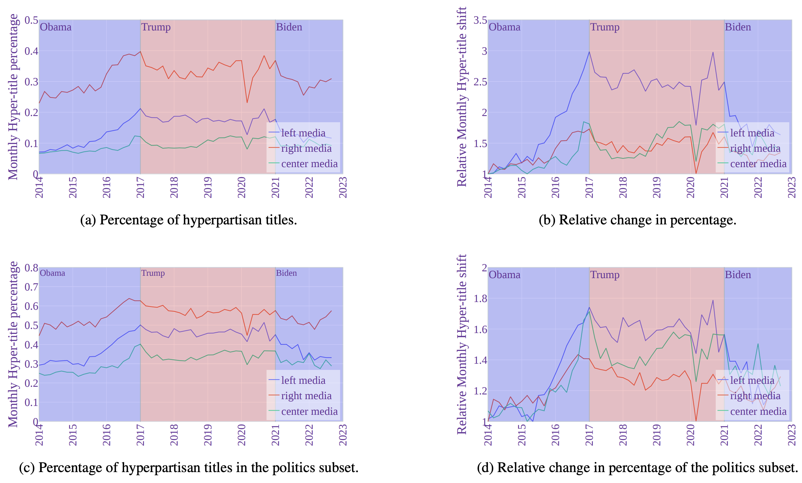

# [Computational Assessment of Hyperpartisanship in News Titles](https://arxiv.org/abs/2301.06270)


In this study, we conduct a computational analysis to quantify the extent and dynamics of partisanship in news titles. While some aspects are as expected, our study reveals new or nuanced differences between the three media groups. [[PDF](https://ojs.aaai.org/index.php/ICWSM/article/view/31368/33528)]

## Authors

[Hanjia Lyu](https://brucelyu17.github.io/)\*, Jinsheng Pan\*, Zichen Wang\*, [Jiebo Luo](https://www.cs.rochester.edu/u/jluo/)  

*: equal contribution

Published at [ICWSM 2024](https://www.icwsm.org/2024/index.html/)

**Contact**

Hanjia Lyu (hlyu5@ur.rochester.edu), Jiebo Luo (jluo@cs.rochester.edu)

## Data
The set of 2,200 manually labeled headlines is available, with 2,000 entries in ```training_set.csv``` and 200 in ```testing_set```, both located in ```/data```.
The dataset containing 1.8 million machine labeled headlines is stored in ```/data/headlines_by_year```.


## Citation
```
@inproceedings{hyperpartisan-icwsm24,
title={Computational Assessment of Hyperpartisanship in News Titles},
author={Hanjia Lyu and Jinsheng Pan and Zichen Wang and Jiebo Luo},
booktitle={Proceedings of the International AAAI Conference on Web and Social Media},
volume={18},
pages={999--1012},
year={2024},
url={https://ojs.aaai.org/index.php/ICWSM/article/view/31368},
DOI={10.1609/icwsm.v18i1.31368}
}
```

## Related Work

[WWW 2024] [Unifying Local and Global Knowledge: Empowering Large Language Models as Political Experts with Knowledge Graphs](https://brucelyu17.github.io/papers/PEG.pdf)

[IEEE BigData 2023] [Understanding Divergent Framing of the Supreme Court Controversies: Social Media vs. News Outlets](https://arxiv.org/pdf/2309.09508.pdf)

[MEDIATE 2023] [Bias or Diversity? Unraveling Fine-Grained Thematic Discrepancy in U.S. News Headlines](https://workshop-proceedings.icwsm.org/pdf/2023_25.pdf)

[MM 2022] [Understanding Political Polarization via Jointly Modeling Users, Connections and Multimodal Contents on Heterogeneous Graphs](https://arxiv.org/pdf/2201.05946)
